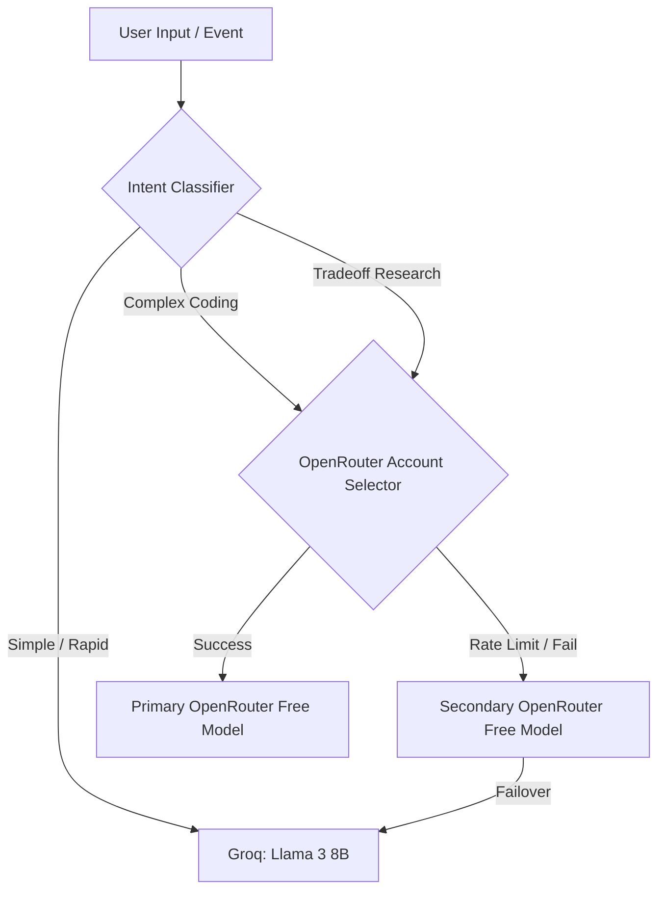

# ZeroClaw Model Routing Architecture

This document defines the configuration and routing logic for the ZeroClaw LLM interface. The architecture is optimized for cloud-only execution using free-tier providers to guarantee zero operational cost, high availability, and lightweight runtime execution on containers (such as Hugging Face Spaces).

## Core Specifications

| Attribute | Configuration | Purpose |
| :--- | :--- | :--- |
| **Offline Models** | None (Disabled) | Eliminates memory footprint and execution dependencies on local host. |
| **Cloud Providers** | OpenRouter (2 Accounts) + Groq (1 Account) | Ensures failover resilience and maximizes daily API call quotas. |
| **Total LLM Suite** | 8 Cloud Free Models | Curated selection of lightweight, high-performance open-weight models. |

---

## 1. Provider & Account Orchestration

### OpenRouter (Dual-Account Setup)
To prevent rate-limit blocking on free-tier APIs, the runtime supports credential rotation across two independent OpenRouter API accounts:
* **Primary Key (`OPENROUTER_API_KEY_A`)**: Handles the majority of default operations.
* **Secondary Key (`OPENROUTER_API_KEY_B`)**: Utilized in a round-robin rotation or when the primary key triggers `429 Too Many Requests`.

### Groq (Single-Account Setup)
* **Access Key (`GROQ_API_KEY`)**: Used specifically for latency-sensitive tasks (e.g., rapid REPL updates, code diagnostics) and as an emergency failover if both OpenRouter accounts are exhausted.

---

## 2. Supported LLM Registry (8 Free Models)

ZeroClaw routes reasoning calls to a pool of 8 highly capable, free cloud models:

1. **`meta-llama/llama-3-8b-instruct:free`** (General purpose, coding)
2. **`meta-llama/llama-3.1-8b-instruct:free`** (Advanced reasoning, large context)
3. **`google/gemma-2-9b-it:free`** (Creative tasks, structure synthesis)
4. **`qwen/qwen-2.5-7b-instruct:free`** (Multi-language coding, technical explanation)
5. **`microsoft/phi-3-medium-128k-instruct:free`** (Deep context ingestion)
6. **`mistralai/mistral-7b-instruct:free`** (Logical reasoning, instruction compliance)
7. **`openchat/openchat-7b:free`** (Conversational assistance, mentorship)
8. **`gryphe/mythomax-l2-13b:free`** (Roleplay, scenario logic generation)

---

## 3. Dynamic Routing Rules

1. **Primary Route**: All standard commands default to OpenRouter.
2. **Rotational Logic**: If Account A encounters key rate limits or network issues, the routing layer transparently swaps header authorization to Account B.
3. **Emergency Failover**: If both OpenRouter endpoints fail, requests fall back to Groq's high-speed free endpoints to ensure conversation continuity.
